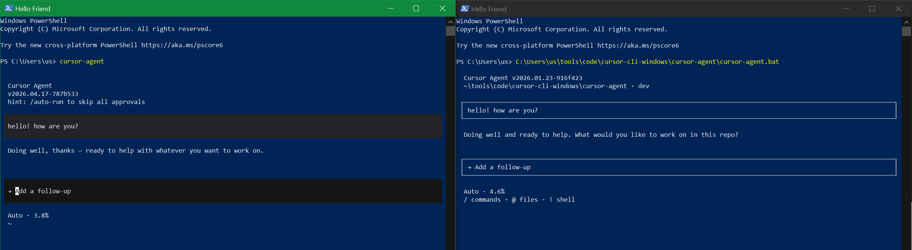

> lol turns out cursor came out with a first party win32 version and i didn't notice: https://cursor.com/docs/cli/installation#windows-native ; here's a side by side ( left: native; right: darwin patched for win32-64 )



# Cursor Agent Windows Patcher

Automatically patches the Cursor Agent CLI package (designed for macOS) to run on Windows by replacing native dependencies with Windows-compatible versions.

## Features

- **Automatic version detection** from official install script
- **Downloads Windows-native binaries** for dependencies (sqlite3, merkle-tree, pty, node runtime, ripgrep)
- **Patches platform detection code** to support Windows
- **Creates launcher scripts** with update interception support
- **Caches binaries** for faster subsequent runs
- **In-place patching** for existing installations
- **Automatic update patching** via `.\patch-cursor-agent.ps1 -Update`

## Prerequisites

- **PowerShell 5.1 or later** (included with Windows 10+)
- **Node.js** (required for Cursor Agent CLI)
- **7-Zip** (optional, for better archive extraction support in PowerShell 5.1)

## Installation

1. Clone this repository:
   ```powershell
   git clone https://github.com/Fire-/cursor-agent-windows-patcher.git
   cd cursor-agent-windows-patcher
   ```

2. Ensure prerequisites are installed:
   - PowerShell 5.1 or later (check with `$PSVersionTable.PSVersion`)
   - Node.js
   - 7-Zip (optional, for better archive extraction)

3. Review and customize `patcher-config.json` if needed (defaults work for most users)

## Quick Start

```powershell
# Patch and install latest Cursor Agent
.\patch-cursor-agent.ps1

# Patch specific version
.\patch-cursor-agent.ps1 -Version "2026.01.23-916f423"

# Patch existing installation
.\patch-cursor-agent.ps1 -PatchExistingInstallation "C:\Users\You\AppData\Local\cursor-agent\versions\2026.04.17-787b533"
```

## Usage Examples

### Standard Installation

Download, patch, and install Cursor Agent:

```powershell
.\patch-cursor-agent.ps1 -Version "2026.01.23-916f423" -InstallPath ".\cursor-agent"
```

**What happens**:
1. Fetches install script from cursor.com
2. Extracts version information
3. Downloads macOS package
4. Extracts package
5. Downloads Windows binaries for dependencies
6. Applies patches
7. Installs to specified path
8. Creates launcher script

### Patching Existing Installation

If you already have Cursor Agent installed:

```powershell
.\patch-cursor-agent.ps1 -PatchExistingInstallation "C:\path\to\cursor-agent\versions\2026.04.17-787b533"
```

This will:
- Detect the installed version
- Download required Windows binaries
- Apply patches to existing files
- Create/update launcher script

### Automatic Update Patching

Enable automatic patching after cursor-agent updates:

```powershell
.\patch-cursor-agent.ps1 -Update
```

This intercepts `cursor-agent update` commands and automatically patches newly updated versions.

### Dry Run (What-If Mode)

Preview what would happen without making changes:

```powershell
.\patch-cursor-agent.ps1 -WhatIf -Verbose
```

Shows detailed output of all operations without executing them.

### Using Custom Config

Use an alternate configuration file:

```powershell
.\patch-cursor-agent.ps1 -ConfigPath ".\custom-patcher-config.json"
```

## Configuration

### patcher-config.json

The main configuration file controls version mappings, cache settings, and installation defaults.

#### versionMappings

Maps Cursor Agent dependency versions to Windows binary sources:

```json
{
  "versionMappings": {
    "sqlite3": {
      "5.1.7": {
        "windowsBinary": {
          "repo": "TryGhost/node-sqlite3",
          "assetPattern": "sqlite3-v5\\.1\\.7-napi-v6-win32-x64\\.tar\\.gz",
          "releaseTag": "v5.1.7"
        }
      },
      "default": {
        "windowsBinary": {
          "repo": "TryGhost/node-sqlite3",
          "assetPattern": "sqlite3-.*-napi-v6-win32-x64\\.tar\\.gz",
          "releaseTag": "latest"
        }
      }
    },
    "merkleTree": {
      "default": {
        "windowsBinary": {
          "repo": "btc-vision/rust-merkle-tree",
          "assetPattern": "rust-merkle-tree\\.win32-x64-msvc\\.node",
          "releaseTag": "latest"
        }
      }
    },
    "ripgrep": {
      "default": {
        "windowsBinary": {
          "repo": "BurntSushi/ripgrep",
          "assetPattern": "ripgrep-.*-x86_64-pc-windows-msvc\\.zip",
          "releaseTag": "latest"
        }
      }
    }
  }
}
```

#### cache

Controls binary caching behavior:

- `directory`: Cache location (default: `%LOCALAPPDATA%\cursor-agent-patcher\cache`)
- `enabled`: Enable/disable caching (default: `true`)
- `validateOnUse`: Verify cached files on use (default: `true`)

#### installation

Installation defaults:

- `defaultPath`: Default installation directory (default: `.\cursor-agent`)
- `createLauncher`: Automatically create launcher script (default: `true`)
- `launcherName`: Name of launcher script (default: `cursor-agent.bat`)

#### cursorAgent

Cursor Agent source configuration:

- `installScriptUrl`: URL to install script (default: `https://cursor.com/install`)
- `downloadBaseUrl`: Base URL for package downloads (default: `https://downloads.cursor.com/lab`)
- `sourceOs`: Source OS for package (default: `darwin`)
- `sourceArch`: Source architecture (default: `arm64`)

### Environment Variables

No environment variables are required for normal usage. Use explicit script parameters like
`-ConfigPath`, `-InstallPath`, and `-Version` to control behavior.

## API Reference

### Get-PatcherConfig

Loads and validates configuration from `patcher-config.json`.

**Syntax**:
```powershell
Get-PatcherConfig [-ConfigPath <String>]
```

**Parameters**:
- `ConfigPath`: Path to configuration file (default: `.\patcher-config.json`)

**Returns**: Hashtable with configuration data

**Example**:
```powershell
Import-Module .\CursorAgentPatcher.psm1
$config = Get-PatcherConfig
$config.cache.directory
```

### Get-CursorAgentVersion

Extracts version string from Cursor Agent install script.

**Syntax**:
```powershell
Get-CursorAgentVersion -InstallScript <String>
```

**Parameters**:
- `InstallScript`: Install script content (required input)

**Returns**: Version string (format: `YYYY.MM.DD-hash`)

**Example**:
```powershell
Import-Module .\CursorAgentPatcher.psm1
$installScript = (Invoke-WebRequest -Uri "https://cursor.com/install" -UseBasicParsing).Content
$version = Get-CursorAgentVersion -InstallScript $installScript
# Returns: "2026.01.23-916f423"
```

### Invoke-CursorAgentPatch

Main patching workflow function.

**Syntax**:
```powershell
Invoke-CursorAgentPatch `
    [-Version <String>] `
    [-InstallPath <String>] `
    [-ConfigPath <String>] `
    [-WhatIf] `
    [-Force] `
    [-PatchExistingInstallation <String>]
```

**Parameters**:
- `Version`: Cursor Agent version to patch (default: latest from install script)
- `InstallPath`: Installation directory (default: from config)
- `ConfigPath`: Path to configuration file
- `WhatIf`: Preview changes without applying
- `Force`: Re-patch even if already patched
- `PatchExistingInstallation`: Path to existing installation to patch in-place

**Returns**: Hashtable with result summary

**Example**:
```powershell
Import-Module .\CursorAgentPatcher.psm1
$result = Invoke-CursorAgentPatch -Version "2026.01.23-916f423"
if ($result.Success) {
    Write-Host "Installation path: $($result.InstallationPath)"
}
```

### New-CursorAgentLauncher

Creates launcher script for patched installation.

**Syntax**:
```powershell
New-CursorAgentLauncher `
    [-InstallPath <String>] `
    [-LauncherName <String>] `
    [-RealCursorAgentPath <String>] `
    [-EnableUpdateInterception]
```

**Parameters**:
- `InstallPath`: Installation directory
- `LauncherName`: Name of launcher script (default: `cursor-agent.bat`)
- `RealCursorAgentPath`: Optional passthrough executable path used in interception mode
- `EnableUpdateInterception`: Enable update interception (default: `false`)

**Returns**: Path to created launcher script

**Example**:
```powershell
Import-Module .\CursorAgentPatcher.psm1
$launcherPath = New-CursorAgentLauncher -InstallPath "C:\cursor-agent"
```

### Get-WindowsArchitecture

Detects Windows architecture (x64 or arm64).

**Syntax**:
```powershell
Get-WindowsArchitecture
```

**Returns**: Architecture string (`"x64"` or `"arm64"`)

**Example**:
```powershell
Import-Module .\CursorAgentPatcher.psm1
$arch = Get-WindowsArchitecture
# Returns: "x64" or "arm64"
```

### Invoke-CursorAgentUpdateWithPatch

Intercepts cursor-agent update commands and automatically patches new versions.

**Syntax**:
```powershell
Invoke-CursorAgentUpdateWithPatch `
    [-UpdateArguments <String[]>] `
    [-Force]
```

**Parameters**:
- `UpdateArguments`: Arguments to pass to cursor-agent update command
- `Force`: Re-patch even if already patched

`Invoke-CursorAgentUpdateWithPatch` also supports the common PowerShell `-WhatIf` parameter.

**Returns**: Hashtable with update and patch results

**Example**:
```powershell
Import-Module .\CursorAgentPatcher.psm1
$result = Invoke-CursorAgentUpdateWithPatch
if ($result.UpdateSuccess -and $result.PatchSuccess) {
    Write-Host "Update and patch completed successfully"
}
```

### Get-CursorAgentVersionDirectory

Detects cursor-agent version directory by resolving launcher target.

**Syntax**:
```powershell
Get-CursorAgentVersionDirectory [-LauncherPath <String>]
```

**Parameters**:
- `LauncherPath`: Path to launcher script (default: searches PATH)

**Returns**: Path to version directory

**Example**:
```powershell
Import-Module .\CursorAgentPatcher.psm1
$versionDir = Get-CursorAgentVersionDirectory
```

## Troubleshooting

### Error: "Failed to download package"

**Possible causes**:
- Network connectivity issues
- Invalid version specified
- Cursor.com server issues

**Solutions**:
1. Check internet connection
2. Verify version exists: `Get-CursorAgentVersion`
3. Try again later if server issues
4. Check firewall/proxy settings

### Error: "Archive extraction failed"

**Possible causes**:
- Corrupted download
- Missing 7-Zip (PowerShell 5.1 limitation)
- Insufficient disk space

**Solutions**:
1. Install 7-Zip for better extraction support
2. Clear cache and retry: Remove `%LOCALAPPDATA%\cursor-agent-patcher\cache`
3. Check available disk space
4. Verify downloaded file is not corrupted

### Error: "Patch application failed"

**Possible causes**:
- File permissions
- Files in use
- Invalid package structure

**Solutions**:
1. Run PowerShell as Administrator
2. Close any processes using Cursor Agent files
3. Verify package structure is correct
4. Check disk space and permissions

### Error: "Binary download failed"

**Possible causes**:
- GitHub API rate limiting
- Network issues
- Invalid version mapping

**Solutions**:
1. Wait and retry (GitHub rate limits reset hourly)
2. Check network connectivity
3. Verify version mapping in `patcher-config.json`
4. Check GitHub release exists for specified version

### Error: "Version extraction failed"

**Possible causes**:
- Install script format changed
- Network issues fetching install script

**Solutions**:
1. Check internet connection
2. Verify install script URL is accessible
3. Try manual version specification: `-Version "YYYY.MM.DD-hash"`

## Advanced Usage

### Using the Module Programmatically

```powershell
Import-Module .\CursorAgentPatcher.psm1

# Get configuration
$config = Get-PatcherConfig

# Extract version
$version = Get-CursorAgentVersion

# Patch with custom options
$result = Invoke-CursorAgentPatch `
    -Version $version `
    -InstallPath "C:\Custom\Path" `
    -WhatIf
```

### Cache Management

Clear cache:
```powershell
Remove-Item -Recurse -Force "$env:LOCALAPPDATA\cursor-agent-patcher\cache"
```

View cache contents:
```powershell
Get-ChildItem "$env:LOCALAPPDATA\cursor-agent-patcher\cache\binaries"
```

Check cache size:
```powershell
$cacheDir = "$env:LOCALAPPDATA\cursor-agent-patcher\cache"
$size = (Get-ChildItem $cacheDir -Recurse | Measure-Object -Property Length -Sum).Sum
Write-Host "Cache size: $([math]::Round($size / 1MB, 2)) MB"
```

### Custom Patch Development

The patcher uses a patch registry system. See `AGENTS.md` for details on developing custom patches.

## Testing

Run the test suite:

```powershell
# Run all tests (requires Pester)
Invoke-Pester

# Run integration tests with critical fail-fast gate first
.\tests\integration\run-end-to-end-failfast.ps1

# Run compatibility matrix (current install-script version by default)
Invoke-Pester -Path tests/integration/version-compatibility.tests.ps1

# Run compatibility matrix for explicit older/newer versions
$env:COMPAT_MATRIX_VERSIONS = "2026.01.23-916f423,2026.04.17-787b533"
Invoke-Pester -Path tests/integration/version-compatibility.tests.ps1

# Run specific test categories
Invoke-Pester -Path tests/properties/
Invoke-Pester -Path tests/integration/
Invoke-Pester -Path tests/state-machines/
Invoke-Pester -Path tests/simulations/
```

**Note**: Integration tests require network access and may take several minutes.

## Contributing

Contributions are welcome! Please see `AGENTS.md` for development guidelines and code style.

### Development Setup

1. Clone the repository
2. Review `AGENTS.md` for PowerShell conventions
3. Check `SPECS.md` for implementation specifications
4. Run tests before submitting changes

### Code Style

- Follow PowerShell approved verbs (`Get-`, `Set-`, `New-`, `Invoke-`, etc.)
- Use `[CmdletBinding()]` for advanced functions
- Include comment-based help for all functions
- Use native PowerShell cmdlets when possible
- Follow error handling patterns from `AGENTS.md`

## License

[Specify your license here]

## Acknowledgments

- Cursor Agent CLI team for the original macOS package
- Contributors to Windows-native dependencies (sqlite3, merkle-tree, ripgrep)

## Related Documentation

- [AGENTS.md](./AGENTS.md) - Development guidelines for AI agents
- [SPECS.md](./SPECS.md) - Implementation specifications
- [docs/testing.md](./docs/testing.md) - Testing framework documentation
